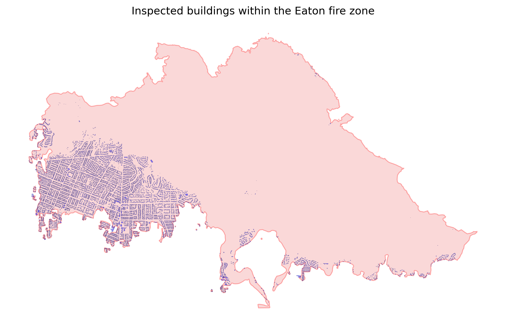
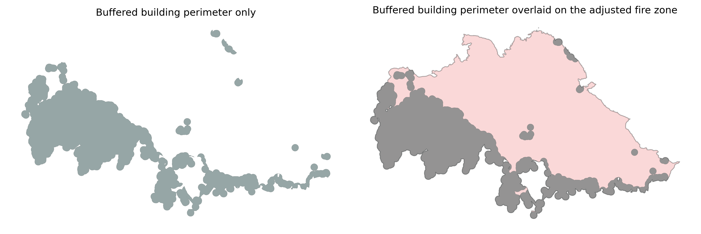

# Buildings in the Eaton fire zone
This program outputs two GeoJSON files. One contains polygon-type building footprint data along with damage inspection information, all within the 2025 Eaton fire perimeter. The other represents a 60-meter buffered perimeter of the buildings, restricted to the Eaton fire perimeter.

## Data Sources
1. **Buildings_2023_with_DINS** [[1]](#1).
This dataset contains building footprints within and near the 2025 Eaton and Palisades fire perimeters, and it integrates Damage Inspection (DINS) data from CalFIRE.

2. **Eaton Fire Perimeter**  [[2]](#2).
  This dataset contains the perimeters for the Eaton and Palisades fires, separately.  In particular, here we will be using the Eaton perimenter only.  
   
## Files and Features
1. `request_buildings.ipynb`:
  This Jupyter Notebook accomplishes the following tasks, most notebly exporting the `eaton_buildings.geojson` file referenced below.
    - Access the LA County Buildings_2023_with_DINS data via ArcGIS REST API.
    - Exclude buildings located outside the Eaton fire perimeter. (Alternatively, as a comment, exclude buildings outside a buffer zone around the perimeter; for example, a 60-meter (~200-foot) buffer (this option is included as a comment in the request_buildings.ipynb file referenced below).
    - Exclude buildings labeled as "Uninspected" or "Inaccessible".  This exclusion is sensible because most such buildings are located outside or near the fire perimeter, typically beyond a layer of inspected buildings marked as "No Damage".  As such, they are unlikely to contribute meaningfully to fire damage analysis.  Furthermore, there are very few uninspected buildings within the fire perimenter, most of which are minor side structures adjacent to inspected buildings. Therefore, excluding them is unlikely to significantly affect the analysis of building damage.  
    - Export the final set of inspected buildings within the Eaton fire perimeter to a GeoJSON file. Below is a very rough visual.

2. `eaton_buildings.geojson`:  
  This is the output GeoJSON file (13.7 MB). The Coordinate Reference System (CRS) is `EPSG:26911`, which corresponds to UTM Zone 11N containing Los Angeles County, and it uses meters as units, making it suitable for distance-based modeling.

3. `eaton_buildings_perimeter60.ipynb`:
   This Jupyter Notebook accomplishes the following tasks, most notebly exporting the `eaton_buildings_perimeter.geojson` file referenced below.
     - Creates a buffer zone of 60 meters around the perimeter of the buildings in `eaton_buildings.geojson`.  Note that 60 meters is approximately 200 feet, which is a commonly recommended defensive zone for fire protection. This buffer parameter of 60 meters can easily be adjusted.
     - Restricts the buffered building perimeter to the Eaton fire perimeter and exports the result to a GeoJSON file. The resulting total area is 12.53 square kilometers. Below is a visual.
      

4. `eaton_buildings_perimeter60.geojson`:
     This is the output GeoJSON file (519 KB). The Coordinate Reference System (CRS) is `EPSG:26911`.  It represents a 60-meter buffered perimeter of the buildings, restricted within the Eaton fire perimeter.

  
## Technologies
-  `Python`
-  `requests`
- `geopandas`
- `shapely`
- `matplotlib` 

## License
This project is licensed under the MIT License — see the [LICENSE](LICENSE) file for details.

## Data Attribution

This repository includes geospatial data obtained from the Los Angeles County Enterprise GIS Hub. The data is provided by Los Angeles County and is subject to the [Los Angeles County Open Data Terms of Use](https://egis-lacounty.hub.arcgis.com/pages/terms-of-use). Please review the terms for any restrictions on use, redistribution, or attribution. For more information, visit the [LA County Enterprise GIS Hub](https://egis-lacounty.hub.arcgis.com/).

## References
1.  County of Los Angeles, California, Enterprise GIS Repository. [Buildings 2023 with DINS](https://services.arcgis.com/RmCCgQtiZLDCtblq/ArcGIS/rest/services/Buildings_2023_with_DINS/FeatureServer/4)
2.  County of Los Angeles, California, Enterprise GIS Repository. [Eaton Fire Perimeter](https://egis-lacounty.hub.arcgis.com/maps/ad51845ea5fb4eb483bc2a7c38b2370c/about)

