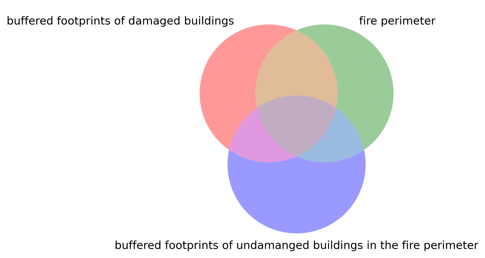

# Buildings in the 2025 Eaton Fire zone
This program produces three GeoJSON files.  One contains the adjusted Eaton fire perimeter.  Another contains polygon-type building footprint data along with damage inspection information, all within the adjusted fire perimeter. The other represents a 150-meter buffered perimeter of the building footprints, restricted to the adjusted fire perimeter.  We will describe them more precisely below.  These outputs are all derived data from the sources referenced below.

## Data Sources
1. **Buildings_2023_with_DINS** [[1]](#1).
This dataset contains building footprints within and near the 2025 Eaton and Palisades fire perimeters, and it integrates Damage Inspection (DINS) data from CalFIRE.

2. **Eaton Fire Perimeter**  [[2]](#2).
  This dataset contains the perimeters for the Eaton and Palisades fires, separately.  We will be using the Eaton perimenter only.  Despite it being the official fire perimeter, it is not 100% accurate.  In particular, some of the clearly burnt areas are not included within the fire perimeter; for example, the fire perimeter cuts through the middle of some buildings that were completely destroyed. We will use the term *fire perimeter* to refer to the boundary provided by this dataset, and *adjusted fire perimeter* to refer to the version in `eaton_adjusted_fire_perimeter.geojson`, described below.
   
## Files and Features
1. `buildings_request_derivation.ipynb`:
   This Jupyter Notebook accomplishes the following tasks. most notebly exporting the three `.geojson` files referenced below.
    - Access the LA County Buildings_2023_with_DINS data via ArcGIS REST API.
    - As the dataset above contains the Palisades area as well, we exclude that and only retain buildings in the greater Eaton area.
    - Exclude buildings labeled as "Uninspected" or "Inaccessible", so only retain inspected buildings.  This exclusion is sensible because most such buildings are located outside of the fire perimeter, typically beyond a layer of inspected buildings marked as "No Damage".  As such, they are unlikely to contribute meaningfully to fire damage analysis.  Furthermore, there are very few uninspected buildings within the fire perimenter, most of which are minor side structures adjacent to inspected buildings. Therefore, excluding them is unlikely to significantly affect the analysis of building damage.
    - Creates the three `.geojson` files below.
      
2. `eaton_adjusted_fire_perimeter.geojson`
    This is the output GeoJSON file (246 KB). The Coordinate Reference System (CRS) is `EPSG:26911`, which corresponds to UTM Zone 11N containing Los Angeles County, and it uses meters as units, making it suitable for distance-based modeling.  The adjusted fire perimeter is the union of the fire perimeter with the 150-meter buffered footprints of the damaged buildings. The buffer size of 150 meters (approximately 500 feet) was chosen based on several considerations: the typical extent of fire impact, the median length of a city block, and the scale of neighborhoods containing a mix of damaged and undamaged buildings. This buffer allows for analysis of spatial patterns at a meaningful neighborhood scale. There are 9899 damaged buildings. 

3. `eaton_buildings.geojson`:  
  This is the output GeoJSON file (18.7 MB). The Coordinate Reference System (CRS) is `EPSG:26911`.  It contains polygon-type footprint data along with damage inspection information for all inspected buildings within the adjusted fire perimeter.  It contains 17407 buildings.

4. `eaton_buildings_perimeter.geojson`:
     This is the output GeoJSON file (334 KB). The Coordinate Reference System (CRS) is `EPSG:26911`.  It represents a 150-meter buffered perimeter of the buildings in `eaton_buildings.geojson`, clipped to remain within the adjusted fire perimeter.  The resulting total area is 22 square kilometers.

## Visualization
Below is a rough plot of the buildings in the `eaton_buildings.geojson`. The fire perimeter is outlined in red color.  The adjusted fire perimeter is colored is filled in cyan color.  

Below is a plot of area within the perimeter given by `eaton_buildings_perimeter.geojson`.  

Below is a Venn diagram for visualizing the different regions. Region A represents buffered footprints of damaged buildings.  Region B represents the fire perimeter.  Note that within B, but not in A, there are some undamaged buildings.  Region C represents buffered footprints of undamaged buildings located within the fire perimeter.  Note that the building footprints in C will all be contained in B; however, the buffered footprints might go out of B.  The union of A and B is the adjusted fire zone.  The area within the perimeter given by `eaton_buildings_perimeter.geojson` is given by (A union C) intersect (A union B)

  
## Technologies
-  `Python`
-  `requests`
- `geopandas`
- `shapely`
- `matplotlib`
- `matplotlib_venn`

## License
This project is licensed under the MIT License — see the [LICENSE](LICENSE) file for details.

## Data Attribution

This repository includes geospatial data obtained from the Los Angeles County Enterprise GIS Hub. The data is provided by Los Angeles County and is subject to the [Los Angeles County Open Data Terms of Use](https://egis-lacounty.hub.arcgis.com/pages/terms-of-use). Please review the terms for any restrictions on use, redistribution, or attribution. For more information, visit the [LA County Enterprise GIS Hub](https://egis-lacounty.hub.arcgis.com/).

## References
1.  County of Los Angeles, California, Enterprise GIS Repository. [Buildings 2023 with DINS](https://services.arcgis.com/RmCCgQtiZLDCtblq/ArcGIS/rest/services/Buildings_2023_with_DINS/FeatureServer/4)
2.  County of Los Angeles, California, Enterprise GIS Repository. [Eaton Fire Perimeter](https://egis-lacounty.hub.arcgis.com/maps/ad51845ea5fb4eb483bc2a7c38b2370c/about)

