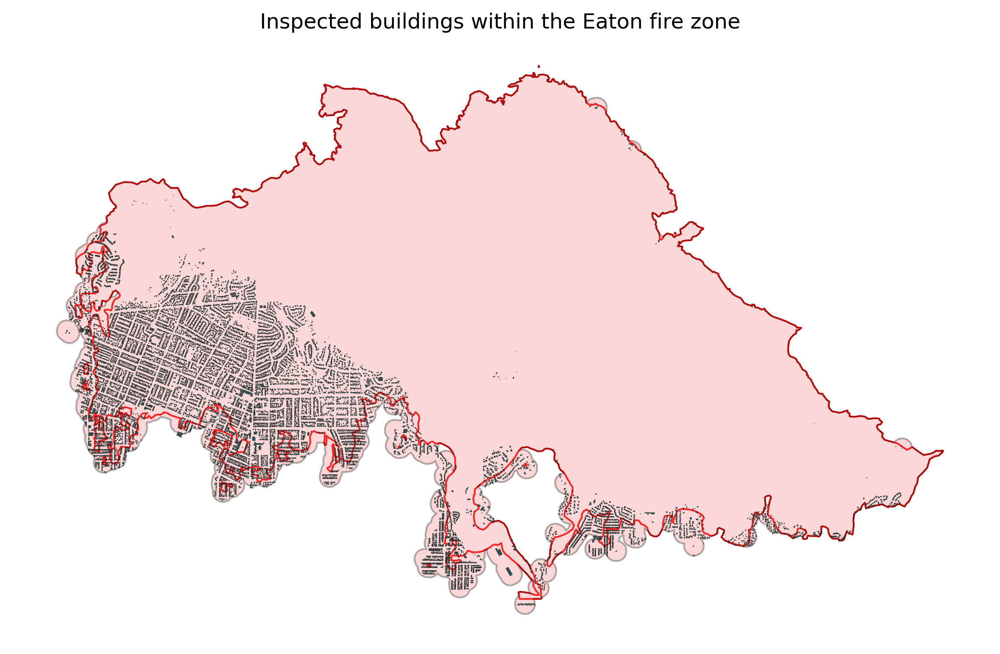

# Eaton fire buildings query
This repository contains a GeoJSON file that contains the polygon type building footprint data, along with the damage inspection information, within the fire perimeter of the 2025 Eaton fire. 

## Data Sources
1. **Buildings_2023_with_DINS** [[1]](#1).
This dataset contains building footprints within and near the 2025 Eaton and Palisades fire perimeters, and it integrates Damage Inspection (DINS) data from CalFIRE.

2. **Eaton Fire Perimeter**  [[2]](#2).
  This dataset contains the perimeters for the Eaton and Palisades fires, separately.  In particular, here we will be using the Eaton perimenter only.  
   
## Goals
- Access the LA County Buildings_2023_with_DINS data via ArcGIS REST API.
- Exclude buildings located outside the Eaton fire perimeter. Alternatively, exclude buildings outside a buffer zone around the perimeter; for example, a 60-meter (~200-foot) buffer (this option is included as a comment in the request_buildings.ipynb file referenced below).
- Exclude buildings labeled as "Uninspected" or "Inaccessible".  This exclusion is sensible because most such buildings are located outside or near the fire perimeter, typically beyond a layer of inspected buildings marked as "No Damage".  As such, they are unlikely to contribute meaningfully to fire damage analysis.  Furthermore, there are very few uninspected buildings within the fire perimenter, most of which are minor side structures adjacent to inspected buildings. Therefore, excluding them is unlikely to significantly affect the analysis of building damage.  
- Export the final set of inspected buildings within the Eaton fire perimeter to a GeoJSON file. Here is a very rough visual of them plotted in the `request_buildings.ipynb` file referenced below.

## Files
- `request_buildings.ipynb`:  
  This Jupyter Notebook accomplishes the goals listed above.

- `eaton_buildings.geojson`:  
  This is the output GeoJSON file (13.7 MB). The Coordinate Reference System (CRS) is `EPSG:26911`, which corresponds to UTM Zone 11N containing Los Angeles County, and it uses meters as units, making it suitable for distance-based modeling.

  
## Technologies
-  `Python`
- `geopandas`
- `requests`
- `matplotlib` 

## License
This project is licensed under the MIT License — see the [LICENSE](LICENSE) file for details.

## References
1.  County of Los Angeles, California, Enterprise GIS Repository. [Buildings 2023 with DINS](https://services.arcgis.com/RmCCgQtiZLDCtblq/ArcGIS/rest/services/Buildings_2023_with_DINS/FeatureServer/4)
2.  County of Los Angeles, California, Enterprise GIS Repository. [Eaton Fire Perimeter](https://egis-lacounty.hub.arcgis.com/maps/ad51845ea5fb4eb483bc2a7c38b2370c/about)

